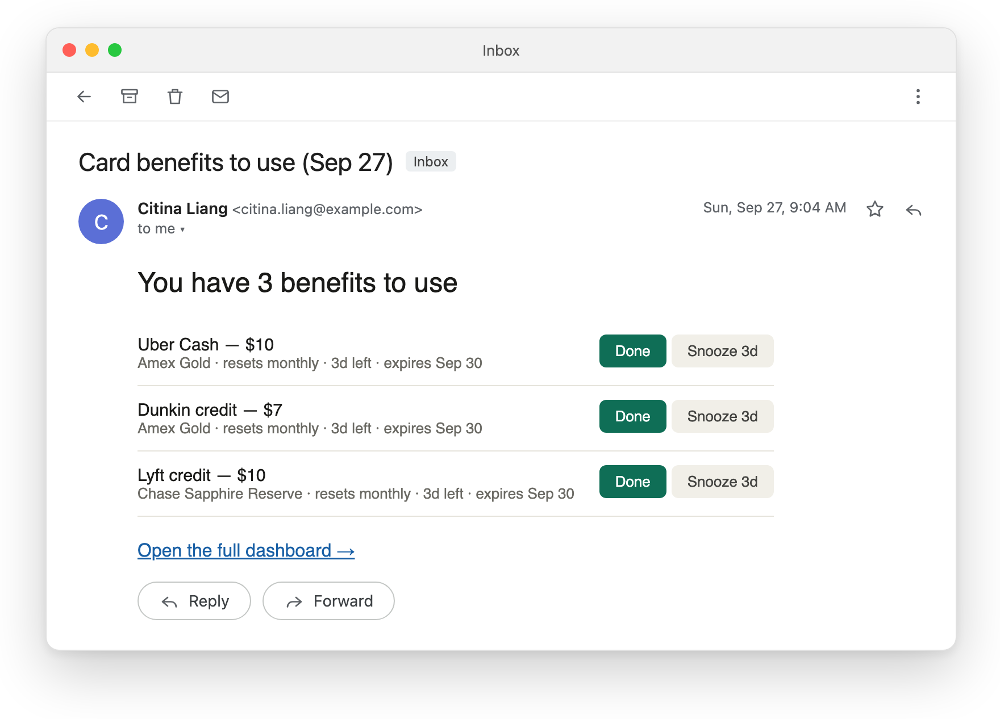
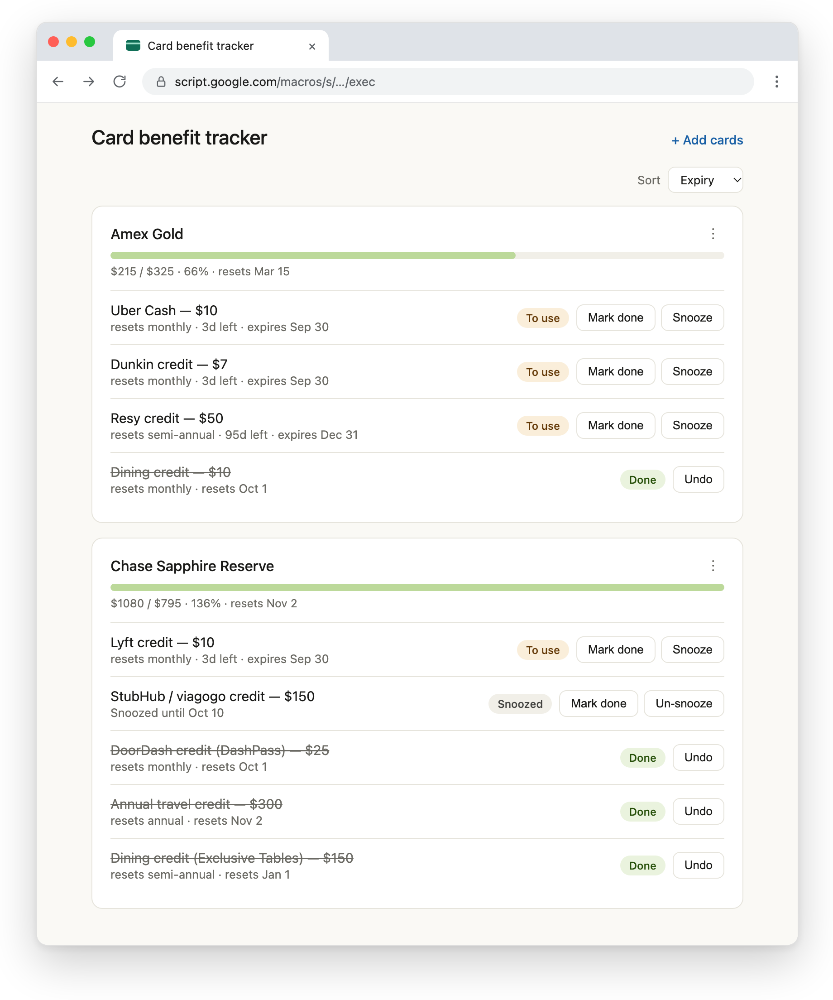

# Credit Card Benefit Tracker

A private reminder for use-it-or-lose-it credit card benefits ("$10 Uber Cash every month",
"$300 travel credit per cardmember year") so they don't expire unused. It runs entirely inside
your own Google account on **Google Apps Script + Sheets + Gmail**: no server to host, no
third-party services, no bank linking.

It's not a rewards optimizer. It just makes sure you use the credits you're paying an annual fee for.

**Daily reminder email**, sent from you, to you:

**Dashboard**, your private web app:

The email and dashboard content is rendered from this repo's code with made-up demo data; the mail and browser windows around them are mockups.

## Features

- **Daily email checklist** of benefits that just reset or are about to expire, with **Done** /
  **Snooze** links. Each link opens a confirmation page; clicking a link never changes anything by itself.
- **Web dashboard** (a private web app): what's used, what's due, and when each credit expires.
  Mark done, snooze, undo.
- **Add-cards wizard** backed by a built-in catalog of popular premium cards. Pick a card and tick
  the benefits you have, or type in your own.
- **Reset cadences:** monthly, quarterly, semiannual, annual, or once. Periods follow the calendar,
  or your **cardmember anniversary** for benefits that reset that way.
- **Annual-fee progress bar:** the value you've actually used this card year vs. the annual fee.
- **Catalog freshness:** every card shows when its terms were last verified, and a monthly email
  lists entries that are due for a re-check.
- Reminder cadence preset (`minimal` or `persistent`), English / 中文 UI, mobile-friendly.

## Private by design

- Deployed as a web app that **executes as you** with access set to **"Only myself"**. Google
  sign-in is the gate, so a leaked link is useless to anyone else.
- Your data lives in **your own Google Sheet**. The app talks only to Google (Sheets, Gmail).
- **To share it, share the code.** Everyone deploys their own copy in their own account. Never give
  anyone access to yours.

The full security model, including the trade-offs of the optional sharing modes, is in
[BUILD_SPEC.md](BUILD_SPEC.md).

## Quick start

Step-by-step guide: **[SETUP.md](SETUP.md)**.

1. Create a Google Sheet, then **Extensions → Apps Script**.
2. Paste in `Code.gs`, and add HTML files named `Index`, `Confirm`, and `AddCards` with the
   contents of the matching `.html` files.
3. Run `setup()` once. It creates the sheets and the daily trigger.
4. **Deploy → New deployment → Web app**: execute as **Me**, access **Only myself**.
5. Save the `/exec` URL as the Script Property `WEBAPP_URL` (**Project Settings → Script properties**).
6. Open that URL and click **+ Add cards**.

## About the card catalog

The shipped catalog is a best-effort snapshot, and the wizard shows each card's "last verified"
date. Issuers change terms often, so confirm amounts and reset rules with your issuer and edit the
`Catalog` sheet (or any tracked benefit) to match. Corrections are welcome as issues or pull requests.

Card and program names are trademarks of their respective owners. This project isn't affiliated
with any issuer and isn't financial advice.

## Files

| File | What it is |
|------|------------|
| `Code.gs` | Apps Script server: config, sheet schema, reminder engine, web-app routes, card catalog |
| `Index.html` | Dashboard |
| `AddCards.html` | Add / edit cards wizard |
| `Confirm.html` | Confirmation page for the Done / Snooze email links |
| `verify.js` | Local test harness (Node, no dependencies, not deployed) |
| `SETUP.md` | Deployment guide |
| `BUILD_SPEC.md` | Design, data model, security model |
| `PITFALLS.md` | Non-obvious traps. Read before changing the engine |
| `HANDOFF.md`, `NEXT_CHAT_HANDOFF.md` | Development notes and backlog |

## Development

`node verify.js` checks the HTML inline scripts and the en/zh string tables, and runs the
period, reminder, and value logic against Apps Script stubs. There's no build step: edit, run
`verify.js`, paste the files into Apps Script, then **Deploy → Manage deployments → Edit → New
version**.

## License

[MIT](LICENSE)
